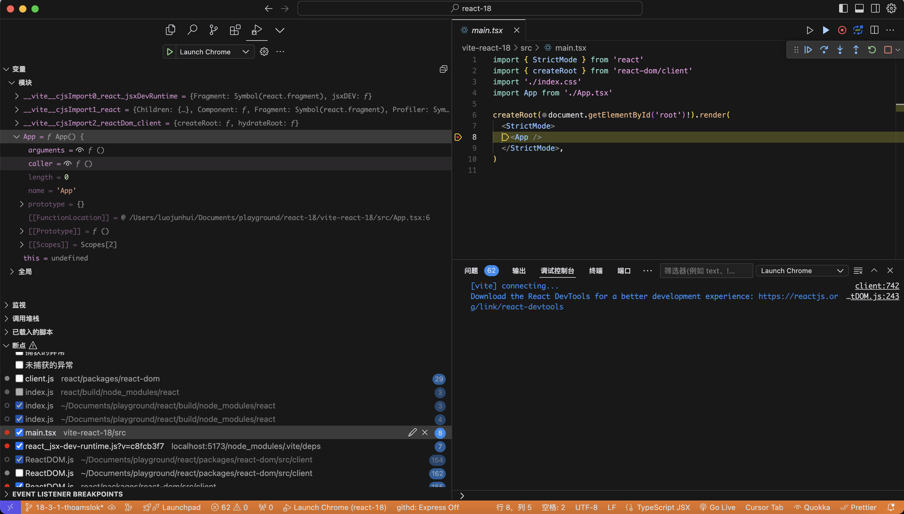

reference: https://www.twotwoba.site/blog/frame/react-source-debug
# 0x00 配置你的环境

```md
requiremenets:
-node 20.18.1
-react 18.3.1
-react-dom 18.3.1
-pnpm 9.15.1
```
react源码和自己创建的项目放在同一个文件夹下


## 获取react源码
我这边是fork了一份出来，然后下载我仓库里面的react源码
然后新建一个react-18.3.1的分支

`react/scripts/rollup/build.js/getRollupOutputOptions`
```diff
function getRollupOutputOptions(
  outputPath,
  format,
  globals,
  globalName,
  bundleType
) {
  const isProduction = isProductionBundleType(bundleType);

  return {
    file: outputPath,
    format,
    globals,
    freeze: !isProduction,
    interop: false,
    name: globalName,
-    sourcemap: false,
+    sourcemap: true,
    esModule: false,
  };
}
```

把transfrom、close、prettier、renderChunk、stripUnusedImports插件注释点，不然buid会报错
```diff
function getPlugins(
  entry,
  externals,
  updateBabelOptions,
  filename,
  packageName,
  bundleType,
  globalName,
  moduleType,
  pureExternalModules,
  bundle
) {
  const forks = Modules.getForks(bundleType, entry, moduleType, bundle);
  const isProduction = isProductionBundleType(bundleType);
  const isProfiling = isProfilingBundleType(bundleType);
  const isUMDBundle =
    bundleType === UMD_DEV ||
    bundleType === UMD_PROD ||
    bundleType === UMD_PROFILING;
  const isFBWWWBundle =
    bundleType === FB_WWW_DEV ||
    bundleType === FB_WWW_PROD ||
    bundleType === FB_WWW_PROFILING;
  const isRNBundle =
    bundleType === RN_OSS_DEV ||
    bundleType === RN_OSS_PROD ||
    bundleType === RN_OSS_PROFILING ||
    bundleType === RN_FB_DEV ||
    bundleType === RN_FB_PROD ||
    bundleType === RN_FB_PROFILING;
  const shouldStayReadable = isFBWWWBundle || isRNBundle || forcePrettyOutput;
  return [
    // Shim any modules that need forking in this environment.
    useForks(forks),
    // Ensure we don't try to bundle any fbjs modules.
    forbidFBJSImports(),
    // Use Node resolution mechanism.
    resolve({
      skip: externals,
    }),
    // Remove license headers from individual modules
    stripBanner({
      exclude: 'node_modules/**/*',
    }),
    // Compile to ES2015.
    babel(
      getBabelConfig(
        updateBabelOptions,
        bundleType,
        packageName,
        externals,
        !isProduction,
        bundle
      )
    ),
    // Remove 'use strict' from individual source files.
    // {
    //   transform(source) {
    //     return source.replace(/['"]use strict["']/g, '');
    //   },
    // },
    // Turn __DEV__ and process.env checks into constants.
    replace({
      __DEV__: isProduction ? 'false' : 'true',
      __PROFILE__: isProfiling || !isProduction ? 'true' : 'false',
      __UMD__: isUMDBundle ? 'true' : 'false',
      'process.env.NODE_ENV': isProduction ? "'production'" : "'development'",
      __EXPERIMENTAL__,
      // Enable forked reconciler.
      // NOTE: I did not put much thought into how to configure this.
      __VARIANT__: bundle.enableNewReconciler === true,
    }),
    // The CommonJS plugin *only* exists to pull "art" into "react-art".
    // I'm going to port "art" to ES modules to avoid this problem.
    // Please don't enable this for anything else!
    isUMDBundle && entry === 'react-art' && commonjs(),
    // Apply dead code elimination and/or minification.
    // isProduction &&
    //   closure(
    //     Object.assign({}, closureOptions, {
    //       // Don't let it create global variables in the browser.
    //       // https://github.com/facebook/react/issues/10909
    //       assume_function_wrapper: !isUMDBundle,
    //       renaming: !shouldStayReadable,
    //     })
    //   ),
    // HACK to work around the fact that Rollup isn't removing unused, pure-module imports.
    // Note that this plugin must be called after closure applies DCE.
    // isProduction && stripUnusedImports(pureExternalModules),
    // Add the whitespace back if necessary.
    // shouldStayReadable &&
    //   prettier({
    //     parser: 'babel',
    //     singleQuote: false,
    //     trailingComma: 'none',
    //     bracketSpacing: true,
    //   }),
    // License and haste headers, top-level `if` blocks.
    // {
    //   renderChunk(source) {
    //     return Wrappers.wrapBundle(
    //       source,
    //       bundleType,
    //       globalName,
    //       filename,
    //       moduleType,
    //       bundle.wrapWithModuleBoundaries
    //     );
    //   },
    // },
    // Record bundle size.
    sizes({
      getSize: (size, gzip) => {
        const currentSizes = Stats.currentBuildResults.bundleSizes;
        const recordIndex = currentSizes.findIndex(
          record =>
            record.filename === filename && record.bundleType === bundleType
        );
        const index = recordIndex !== -1 ? recordIndex : currentSizes.length;
        currentSizes[index] = {
          filename,
          bundleType,
          packageName,
          size,
          gzip,
        };
      },
    }),
  ].filter(Boolean);
}

```

## react编译
```bash
# node 20有可能会报错，切到支持的node版本再编译 我用的是node 16.14.0
nvm use 16.14.0
# 编译全部模块
yarn build --type=NODE
# 当然你也可以选择只编译这几个部分
yarn build react/index,react/jsx,react-dom/index,scheduler --type=NODE
```

编译完成后，创建全局软链，等着给后面项目中引用，分别进入 build/node_modules/react 和 build/node_modules/react-dom 下：
```
# 创建软链接前切回来node 20
nvm use v20
# 创建全局软链
pnpm link -g
```


## 用vite来创建项目
```bash
npm install -g vite
```

```bash
# 创建你的项目
vite create vite-react-18
```

vite-react-18/package.json <br>
```diff
-  "dependencies": {
-    "react": "^18.3.1",
-    "react-dom": "^18.3.1"
-  }
```

vite-react-18/vite.config.ts

```diff
build: {
    rollupOptions: {
+       external: ['react', 'react-dom']
        output: {
+            globals: {
+                react: 'React',
+                'react-dom': 'ReactDOM'
+            }
        }
    }
}
```

接着给项目安装完依赖后，再用 pnpm 引用全局的软链：
```bash
pnpm install
pnpm link -g react react-dom
```

## DEBUG

```bash
# 启动项目
pnpm run dev
```

vs调试设置`launch.json`
```json
{
    "configurations": [
    {
        "name": "Launch Chrome",
        "request": "launch",
        "type": "chrome",
        "url": "http://localhost:5173",
        "webRoot": "${workspaceFolder}/vite-react-18"
    }
    ]
}
```

这个时候我们就能在react源码中打断点调试了



